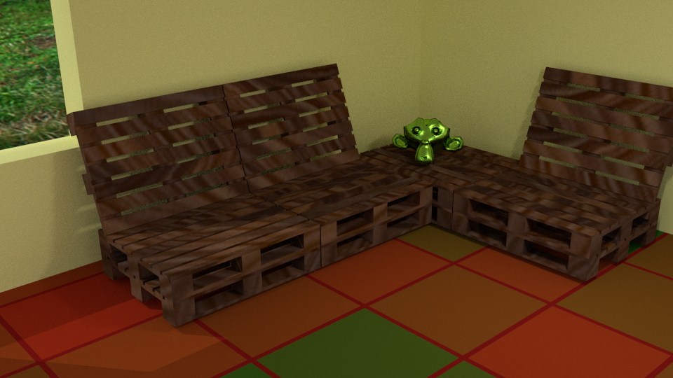

# scad_learning
Repository with my experiences with OpenSCAD http://www.openscad.org/

## OpenSCAD
OpenSCAD is a free software for creating CAD models.

Examples are located in the `cad` directory.

## Renders
These are some renders made with Blender from the generated `stl` file using Cycles renderer:

### Pallet Sofa

### Stairs

